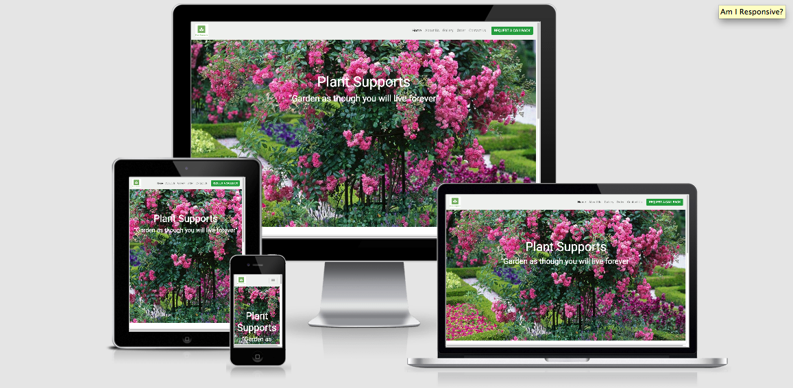
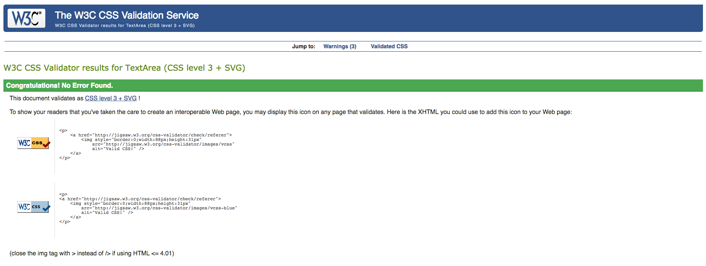
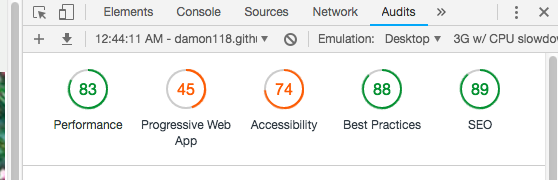
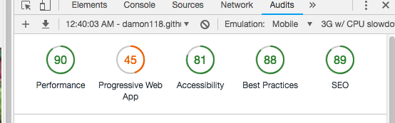

# Plant Supports

[View Website](https://damon118.github.io/MS1-Plant-Supports/) 

 

## Table of Contents 

[Introduction](#Introduction) 

[UX](#UX)

[Design](#Design) 

[Features](#Features)

[Technologies](#Technologies) 

[Testing](#Testing)

[Deployment](#Deployment) 

[Credits](#Credits)

## Introduction

This website was constructed as the e-commerce hub and digital marketing platform for a start-up business - plantsupports.ie. The pandemic
has created a new generation of horticulture and gardening enthusiasts, and indeed rekindled a few old flames, who have found that growing 
is good for the soul, promotes emotional and mental wellbeing, reduces stress, boosts mood and  provides a sense of fulfilment. Plant  
supports are a contemporary and effective method of gardening which have a number of key benefits that make them popular with gardeners of 
all levels of expereience.

### Benefits include: 

-	As the name suggests, providing support and structure, which can help prevent plants from breaking or falling over due to windy conditions 
    or heavy, overloaded branches. Broken or damaged stems are pathways for pests and disease. 

-	Correct support also helps keep fruits off the ground, where they can become damaged, rot or fall victim to insects.  

-	Upright plants are easier to maintain and don’t have issues with soil splash from watering or heavy rains, where soil-borne fungus can take 
    hold. Harvesting is also made easier too.  

-	Finally, plants having adequate support throughout the growing season are stronger and healthier overall since they’re not blowing all over 
    the place, which weakens them over time. 

In Ireland, many garden centres and retailers are closed, and the future is incredibly uncertain. Most retailers and suppliers have made efforts 
to increase their online presence and promote e-commerce. With this project, we set out to establish an online presence for our start-up business, 
address the relatively slow uptake of e-commerce solutions by retailers in the horticultural sector in Ireland, provide optimal user experience 
and produce a real-life demonstration of my development expertise for my user centric frontend development milestone project. It’s designed to 
be responsive and accessible on a range of devices, making it easy to navigate for potential customers. 

## UX 

### Business Goals 

- The principal purpose of this site is to sell and market a product. The product in my MS1 project are different varities and dimensions of 
  metallic plant supports, with a broad target market ranging from avid, experienced gardeners to novice and those with only a transient interest. 
- Provide a good user experience. 
- Provide clear logic and benefits of utilising the product with engaging and captivating imagery and video examples. 
- Promote and present the different product models and their features/specifications.
- Build brand awareness.
- Promote sales, business development and engagement with prospective customers through the use of a contact form.

### User Goals 

- Understand the purpose and benefits of the product.
- Have different options and product specifications to best suit their needs.
- View the product in use and see it's value in action.
- Clear product specifications and pricing.
- Intuitive ordering process. 

### User Scenarios 

#### Ideal client 

#### The ideal client for this business is: 

- English speaking.
- Has an interest in gardening or horticulture.
- Has disposbale income and is willing to invest in their garden. 
- Lives in Ireland or Northern Ireland 
- If living abroad, not adverse to shipping fees due to the nature (size and weight) of the product 

#### Visitors to this website are searching for: 

- Products to augment their garden and improve their gardening techniques and methods
- Education on the benefits and purpose of plant supports 
- A point of contact to discuss their requirements and receive advice

#### This project is the best way to help them achieve these things because: 

- Clear and concise information is provided on the purpose and benefits of using the product
- Appealing and attractive images of the product in use are present in the gallery
- Garden centre and supplier websites in Ireland are typically limited and have poor UX 
- This project has good UX and is tailored to it's target market through ease of navigation, aesthetically
  pleasing content and contact form for expert advice and consultation if required

#### As a new user I need to: 

- Understand the purpose and value of the product.
- Easily navigate through the website.
- Be able to contact a business representative for further information or advice.
- Find clear information about the product specifications and pricing. 
- Find testimonials from previous buyers to inspire confience and trust in the business and prodcut
- Find information on who runs the business and where it is located 

#### As a returning user I want to:  

- Find community and social links to engage with
- See if there are any new products or promotions 
- Review testimonials from other customers
- Receive further information and advice regarding the product 
- Sign up to a newsletter or email service about any new business developments 
- Provide feedback on the service and product

### Structure 

This project is a business-to-consumer (B2C) website and is designed to be intuitive, informative and provide a relatively low number of steps to purchase. The landing page and gallery provide 
captivating images to connect with the user while testimonials and the about us section help inspire trust and conifidence in the business. The contact form provides and clear and easy way for
customers to engage with the business and address any queries or concerns.

#### Interaction design

- Responsive and accesible on a range of devices 
- Visually pleasing displays 
- Low number of steps to purchase or contact
- The interfact interacts with user actions as expected, the scroll/swipe actions respond with the normal behaviour and buttons acts instantly on press. These features generate a predictable
  feel for the user.

#### Information architecture 

- Constructed with a focus on simplicity, so that no extraneous information and functionality is present and overload is avoided.
- The content is organised and prioritised by importance from top to bottom and left to right in terms of position on the page. 

### Wireframes 

Home Page - **[View](assets/images/wireframe1.png)** 

About Us - **[View](assets/images/wireframe2.png)**

Gallery - **[View](assets/images/wireframe3.png)**

Order - **[View](assets/images/wireframe4.png)**

Contact Us - **[View](assets/images/wireframe5.png)**

- These were the initial wireframes created during the project inception phase. As the project and my skills evolved, so too did the design of the site, hence, the wireframes do not exactly mirror the 
  final project.

## Design

### Typography

- The Roboto font was the chosen font for the body of this site with Sans Serif as the safe alternative in the case of Roboto not being imported 

- Roboto is a widespread and visually-pleasing font style. Roboto is a neo-grotesque sans-serif typeface family developed by Google as the system font 
  for its mobile operating system Android. I have seen it utilised effectively on a number of similar websites during my research and selected it for this project.

### Imagery 

- The imagery selected is a key feature for attracting prospective buyers. The large hero-image on the Home Page is designed to be striking, to catch the user's attention and
to show an example of the product being put to effective use. There is an image of the father and son team in the About Us page to help personalize the business story. There is
also an image gallery with six eye-catching photos of the product range, designed to be visually-appealing and entice the viewer into a purchase. 

### Colour Schemes

- The website generally has bright and vibrant colours,  which is in keeping with the product and it's purpose - to improve a garden. A light grey theme was utilised for the navbar and
footer. This helps the call-to-action button in the navbar, along with the logo, standout as much as possible. There is a recurring theme of green throughout the website, again, in line
with the subject matter. The shade of green was selected in the planning and research stage of the project and is rgb(114, 214, 84). A bright tone is present on most pages, creating an 
aesthetic and relatively simple design which aids to the intuitiveness of the site as a whole.

## Features 

### Common Features To All Pages 

- Responsive on all device sizes

- Interactive elements 

- The website is divided into five separate pages - a home page, an about us page, a gallery, an order page and contact page.

- Header 

  - Each page has the same header, with company logo located on the left and a navigation menu with a 'Request Callback' CTA button located on the right within the same row. 
  - The company logo is clickable and will link back to the site homepage 
  - The header is fixed at the top of the screen and will scroll with the page contents, allowing users to easily navigate through the website no matter where they are on the page, hence creating an intuitive design. 
  - The navigations links undergo a colour change when a user's cursor hovers over it. This feature is available only a desktop or laptop but indicates to the site user that the 
    navigation link is clickable.
  - On a mobile device the navigation links will collapse into a dropdown button, with the navigation links displaying on the top left of the screen. 
  - The header could be further enhanced in the future by adding functionality to the 'Request Callback' button for site users to book a telephone consultation or seek expert advice

- Footer 

  - Each page has the same footer which is located at the bottom page and does not scroll with the page contents in order to save screen real estate. 
  - A copyright disclaimer is located on the left of the footer which states the year of creation and content creator.
  - To the middle of the footer, is a download brochure option, which will undergo a colour change when the user's cursor hovers over it. 
  - The company social media links are positioned to the right of the footer and each site is represented by it's relative icon. They will also undergo a colour change when 
    a user's cursor hovers over it, again, showing it's a clickable link.

### Home Page

- Hero-Image
- Request callback CTA button 
- Customer testimonials 
- Pop-up shop locations and times

### About Us Page

- Business story 
- Image of proprietors (Helps authenticate business story)
- Product benefits

### Gallery

- Six appealing images of prodcut in use

### Order Page

- Four different pricing cards

### Contact Page

- Contact form
- Business location
- Contact details

### Features to implement in future

- Functionality on the call-to-action buttons. In particular, the CTA button in the header which could be used to arranage telephone consultations with prospective customers and provide expert advice.
- Option to choose language of website. 
- Larger gallery and broader range of products. 
- Google Reviews. 
- FAQ page. 
- Modals for the CTA buttons on the pop-up shop cards. These would include more specific information on the range of products and locations of these events. 
- Newsletter and email marketing signup option for customers.

## Technologies

### Programming Languages 

- HTML5
- CSS3 

### Version Control

- Gitpod as the Integrated Development Environment (IDE)
- Git as version Control
- Github for repo hosting

### Frameworks, Libraries & Programs Used

#### Bootstrap 

- [Bootstrap](https://getbootstrap.com/) was utilised for it's responsiveness and attractive, visually-pleasing styling features

#### Font Awesome 

- [Font Awesome](https://fontawesome.com/) icons were used for aesthetic and user experience design.

#### Google Fonts

- [Google Fonts](https://fonts.google.com/) was chosen as the sole font library due to it's vast and comprehensive nature 

#### Balsamiq 

- [Balsamiq](https://balsamiq.com/wireframes/?gclid=EAIaIQobChMI9Y3WjKvW7QIVDbDtCh3IqgeyEAAYASAAEgIw1_D_BwE) was used to create the mobile, tablet and desktop wireframes in the UX design

#### Google Maps API 

- [Google Maps](https://www.google.com/maps) was used for showing where the business was located  

#### Logo 

- [Canva](https://www.canva.com) was used to create the site logo 

#### Mockups 

- [AmIResponsive](http://ami.responsivedesign.is/) was used to create the mockups for the site

## Testing 

### HTML Validation 

-The HTML was validated online using the [W3C Markup Validation Service](https://validator.w3.org/). The site's five pages were separtely validated using this online tool to ensure that there were no 
syntax or structural errors within the code. The results of this testing are indicated below in the relevant sections.

  -Home Page [(W3C Validation Report)](./assets/images/indexw3c.png) 

   The first testing of the homepage using the validation tool came back with no errors or warnings to report.

  -About Us Page [(W3C Validation Report)](./assets/images/aboutw3c.png) 

   The HTML validation tool reported two errors within the code of the about us page, which were two stray end div tags. The two relevant tags were subsequently removed from the code.

  -Gallery Page [(W3C Validation Report)](./assets/images/galleryw3c.png) 

   The HTML Validation tool highlighted a warning that the section element, which the site gallery is incorporated into, lacks a heading. Right from the project inception and initial design, I had 
   never intended to include a heading for my gallery page. The site is user-friendly, intuitive and has a clear navigation menu that is fixed to whatever page the user is viewing and is relatively basic
   in design. The user would know what page of the site they are currently viewing (active page) through the particular page link in the nav bar being black in colour as dintinct from the non-active options 
   which are grey. Adding a gallery heading could be implemented in the future as the site evolves to identify the section for screen readers, even though it is not currently neccessary for the visual design.
   
  -Order Page [(W3C Validation Report Part 1)](./assets/images/orderw3c1.png) [(W3C Validation Report Part 2)](./assets/images/orderw3c2.png) 

   The HTML validation tool reported six errors within the code of the order page. The relevant br elements were subsequently removed and the code restructured to correct errors 2 and 3 in the above reports.

  -Contact Page [(W3C Validation Report)](./assets/images/contactw3c.png) 

   The first testing of the contact page using the validation tool came back with no errors or warnings to report.

### CSS Validation 

-The CSS was validated online using the [W3C CSS Validation Service](https://jigsaw.w3.org/css-validator/). The site was validated using this online tool to ensure that there were no 
syntax or structural errors within the code and was entered into the validator tool by direct input.

 

### Performance Testing 

- The site was tested on Google Chrome, Mozilla Firefox and Safari Web Browsers, and was fully functioning and responsive. 

- The website was viewed on a variety of devices such as Desktop, tablet, iPhone 7 & iPhone X. All formats were correctly structured and displayed well. 

- I completed a vast array of detailed and comprehensive testing of my site to ensure that all links functioned correctly. This composed of 
  navigating through each page of my site and clicking every link/button that is available to a user (as part of their UX journey) to ensure that everything was fucntioning correctly. I examined the
  user stories indicated in the UX section of this document to ensure my site achieved each of these objectives.

- I requested the my project be peer viewed twice on Slack by my fellow students. I received several positive reviews and important recommendations which I implemented into my project on both occasions.
  A number of my fellow students tested my site in it's entirety and confirmed the site functioned correctly and as expected. 

- [Responsinator](https://www.responsinator.com/) was used to confirm responsiveness on different device resolutions. 

- [Am I Responsive](http://ami.responsivedesign.is/) was also utilised as a high fidelity responsive design tool for previewing and testing site across a variety of popular devices.

- Lighthouse used within Chrome Dev tools to assess performance on desktop & mobile display, final results below: 

#### Desktop: 

 

#### Mobile: 

 

### Known Bugs & Issues

- The Upcoming Pop-up Shops section was originally structured using a table format. Unfortunately, tables don't typically render too well on a mobile so using the relevant bootstrap classes, 
 I made them only appear on large and extra large screens. Following recommendation on slack, and due to a disjointed UX, I changed the structure of the section from a table to a responsive
 bootstrap card so that the promotional information would appear on all screen sizes and maintain my mobile-first design. 

- Removed the fixed-bottom class on the footer as too much screen real estate was being lost in combination with a fixed header. 

- The images in the about us section and gallery are slow to load.

## Deployment

- This project was deployed to GitHub Pages using the following protocol: 

1. Sign in to GitHub and select the revelvant repository
2. Click the settings tab in the menu
3. Scroll down to the Settings page until you arrive at the "GitHub Pages" Section
4. Under the source heading, select the master branch option
5. The page will refresh and deployment to GitHub Pages completed
6. Scroll back to the GitHub pages section and click on the link above the source heading to view the live site

### Making a Local Clone 

1. Sign into GitHub
2. Select the relevant repository
3. Select the code dropdown button beside the Gitpod button
4. Download the ZIP file, unpackage locally and open with IDE.
5. Alternatively, to clone the repository using HTTPS, copy the link under "Clone with HTTPS"
6. Open Gitbash
7. Alter the current working directory to the location the clone is to be made 
8. Type "git clone" and paste the copied URL 
9. Press enter and the local clone is made

## Credits

### Content 

- All content was written by myself, Damon Gaffney, for the purpose of my Professional Diploma in Full Stack Software Development with Code Institute

### Media 

- All images were sourced using the advanced search function in Google Images to select those that were free of copyright 
- The map on the contact page was sourced from Google Maps

### Code

- The customer testimonials in the homepapage and the product benefits listed in aboutus.html were inspired by the Bootstrapping Your Next Big Idea Videos by Matt Rudge of the Code Institute
- [Stack Overflow](https://stackoverflow.com/) and [w3schools](https://www.w3schools.com/)

### Acknowledgements 

- I'd like to thank the community at slack along with the tutor support, who have been absolutely vital to my studies and progress. 
- I'd also like to thank my mentor, Maranatha Ilesanmi, for his time, feedback and help throughout my project

